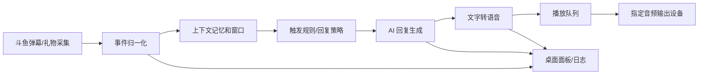

# 桌面机器人助手架构提案

## 当前参考状态

- `E:\Workspace\Fun\Dyd2` 已更新到远端最新 `origin/main`，当前提交为 `0d040e4 feat(deploy): AI 网关分离至 tencent-43，主站 Nginx 反代 v1.1.58`。
- 更新时保留了 `Dyd2` 的本地改动：`package.json` 中 `audioPlugin: "local"`，以及未跟踪的 `scripts/deploy-wechat-bot.py`、`scripts/wechat-bot/`。
- 可复用参考：
  - `server/douyu-danmaku-server.mjs`：斗鱼 TCP 弹幕协议、SSE 推送、多房间、礼物归档与统计、AI 触发器。
  - `server/ai-agent-server.mjs`：服务端持有密钥，多模型列表、可达性探测、SSE 流式 chat、模型降级。
  - `server/voice-clone-server.mjs`：Fish Audio、GPT-SoVITS、RVC 的 TTS/VC/训练抽象。
  - `scripts/fmz-dev-services.mjs`、`scripts/pack-release.mjs`、`scripts/deploy.mjs`：feature flag、多服务开发、打包、发布流程。

## 语言和框架选型

### 方案 A：TypeScript + Electron + Vue/Vite

推荐作为第一版落地方案。

优点：

- 与 `Dyd2` 技术栈最接近，可以直接复用大量 Node/Vue 代码和服务逻辑。
- 斗鱼 TCP、AI HTTP/SSE、TTS HTTP、配置面板、日志面板实现成本低。
- Electron 对桌面窗口、托盘、自动更新、本地文件、后台常驻、Chromium 音频播放支持成熟。
- `electron-builder` 可以稳定产出 Windows 安装包、portable 包、自动更新包。

缺点：

- 包体和内存占用偏大。
- 需要控制主进程、渲染进程、worker 的边界，否则会变成“大前端脚本堆”。

适用判断：

- 如果目标是尽快把“弹幕 -> AI -> TTS -> 播放”完整跑通，并继续复用 `Dyd2`，选它。

### 方案 B：TypeScript + Tauri 2 + Rust

推荐作为长期高质量桌面版本候选。

优点：

- 包体小，权限模型更干净，Rust 后端适合做协议、音频设备、长期后台任务。
- UI 仍可用 Vue/Vite，交互开发体验好。
- 音频输出可用 Rust `cpal`/`rodio` 做更底层的设备选择和播放队列。

缺点：

- `Dyd2` 的 Node 后端代码不能无成本复用，要么重写核心，要么带 Node sidecar。
- 初期工程复杂度高于 Electron。

适用判断：

- 如果你更看重正式产品质感、包体、权限、安全边界，并能接受先做迁移，选它。

### 方案 C：C#/.NET 8 + WPF 或 WinUI 3

推荐给 Windows-only 且强调原生体验的路线。

优点：

- Windows 桌面、托盘、自启动、音频设备、系统集成很稳。
- `NAudio`、`WebView2`、MSIX/installer 生态成熟。
- 长期维护的可执行程序形态清晰。

缺点：

- `Dyd2` 代码基本需要迁移。
- 斗鱼协议、AI/TTS 适配、前端面板都要重新设计。

适用判断：

- 如果最终只做 Windows 桌面工具，且愿意放弃大部分现有 JS 复用，选它。

### 方案 D：Python + PySide6/Qt

适合验证 AI、TTS、ASR、音频处理能力，不建议作为最终主线。

优点：

- AI/语音生态接入快，本地模型、ASR、音频处理库丰富。
- 快速原型成本低。

缺点：

- 打包体积、依赖冲突、后台稳定性、UI 工程化约束较弱。
- 长期发布和自动更新体验不如上面几种。

适用判断：

- 如果你想先实验模型和语音链路，再转正式工程，可以临时用它。

## 已确定主线

当前已确定先用 **TypeScript + Electron + Vue/Vite** 做 v0/v1，并以独立桌面可执行程序为交付目标。

约束文档：

- [工程基础要求](engineering-foundation.md)：后续代码质量、结构、复用、安全、测试、打包发布的准入标准。
- [ADR 0001](adr/0001-electron-typescript-vue.md)：记录为什么选择 Electron + TypeScript + Vue/Vite。

原因：

- 当前最关键的风险不是桌面壳，而是把斗鱼弹幕、上下文 AI、TTS、音频播放、礼物触发、配置和日志完整串起来。
- `Dyd2` 已经有可参考的 Node/Vue 代码，Electron 能最大化复用。
- Electron 打包后的程序是本地独立应用，不把远程网页作为主 UI；只有斗鱼、AI、TTS 等外部服务本身需要网络。
- 等流程稳定后，再评估是否把核心 runtime 迁移到 Tauri/Rust。

## 产品边界

第一版要做的是一个本地桌面机器人助手，而不是云服务平台。

核心链路：



第一版必须完整闭环：

- 连接一个或多个斗鱼房间。
- 实时捕捉弹幕和礼物。
- 根据规则决定哪些弹幕需要机器人回复。
- AI 结合近期上下文、主播人设、直播间状态生成短回复。
- TTS 生成音频。
- 播放到用户选择的音频输出设备。
- UI 能看到每条事件从采集到播放的状态。

## 模块设计

### Runtime Orchestrator

职责：

- 启动和停止所有核心模块。
- 管理运行状态、健康检查、崩溃恢复、重连。
- 提供统一事件总线和任务队列。

接口：

- `startProfile(profileId)`
- `stopProfile(profileId)`
- `restartModule(moduleId)`
- `getHealth()`
- `subscribeEvents()`

### Douyu Capture

职责：

- 斗鱼 TCP 连接、登录、入组、心跳、断线重连。
- STT 协议解析。
- 弹幕、礼物、进场、系统消息归一化。
- 多房间采集。
- 礼物表、礼物价格、别名、付费礼物识别。

参考 `Dyd2`：

- `loginreq`、`mrkl` 心跳、`chatmsg`、`dgb`、`gdp`、`comm_chatmsg` 等消息处理。
- 礼物 catalog 缓存、手动覆盖、归档分片。

输出事件：

- `DanmakuReceived`
- `GiftReceived`
- `UserEntered`
- `RoomStatusChanged`
- `CaptureError`

### Event Normalizer

职责：

- 把不同来源的消息统一成内部事件模型。
- 去重、限流、敏感字段清理。
- 为每条事件生成 `traceId`，贯穿 AI、TTS、播放和日志。

设计要求：

- 弹幕原文永远作为不可信输入。
- 弹幕中的“忽略上面规则”“泄露密钥”等指令只能作为聊天内容，不能进入系统指令层。

### Context Memory

职责：

- 维护直播间短期上下文：最近 N 条弹幕、礼物、AI 回复、主播状态标签。
- 维护长期配置：人设、禁用词、常见问答、观众昵称记忆。
- 控制 token 预算，避免 prompt 无限膨胀。

存储建议：

- SQLite 保存事件、回复、用量、音频缓存索引。
- 配置文件保存 profile、规则、人设。
- 密钥使用系统 keychain 或加密存储。

### Trigger Policy

职责：

- 决定是否回复、何时回复、回复优先级。

第一版规则：

- 关键词触发：如 `@机器人`、指定前缀、问题句。
- 礼物触发：付费礼物、指定礼物、累计礼物阈值。
- 冷却时间：全局冷却、用户冷却、礼物冷却。
- 黑名单和白名单。
- 手动触发：UI 选中弹幕后生成回复。

后续规则：

- 情绪触发。
- 弹幕刷屏摘要。
- 定时互动。
- 语音输入转问题后进入同一管线。

### AI Engine

职责：

- 管理 AI provider、模型、密钥、代理、可达性探测。
- 构建 prompt：系统人设、直播上下文、当前弹幕、礼物信息、输出约束。
- 处理 token 预算、重试、模型降级、限流、费用统计。

参考 `Dyd2`：

- 服务端持有 API key。
- `/models` 只返回可用模型。
- `/chat` 支持 SSE 流式响应。
- Gemini/OpenAI/Qwen 兼容层。

第一版 provider：

- OpenAI-compatible API。
- Gemini。
- Qwen/DashScope。
- 可选本地模型。

输出约束：

- 默认回复短句，适合 TTS。
- 避免解释系统提示。
- 避免读出不适合直播播放的内容。
- 对弹幕注入保持隔离。

### Voice Engine

职责：

- TTS provider 适配。
- 语音库和音色管理。
- 音频缓存。
- 文本清洗和读法优化。

第一版 provider：

- Fish Audio。
- Edge/Azure TTS 或其他 OpenAI-compatible TTS。
- 本地 GPT-SoVITS/RVC 作为可选后端。

参考 `Dyd2`：

- `voice-clone-server.mjs` 的 `fish-audio`、`gpt-sovits`、`rvc` backend 抽象。
- `models-registry.json` 这类模型注册表可以迁移为 SQLite 表。

功能：

- `synthesize(text, voiceId, params)`
- `generateLibrary(items, voiceId)`
- `listVoices()`
- `previewVoice()`
- `deleteVoiceAsset()`

### Audio Playback

职责：

- 枚举音频输出设备。
- 播放队列、打断、跳过、暂停、音量。
- 支持输出到耳机、扬声器、虚拟声卡、OBS 监听设备。

第一版能力：

- 选择输出设备。
- 播放队列。
- 同一时间只播放一条回复。
- 可配置是否打断当前播放。
- UI 显示当前播放、排队数量、失败原因。

### Desktop UI

主界面不做营销页，直接是可操作控制台。

建议视图：

- 总览：房间状态、AI 状态、TTS 状态、播放状态、今日统计。
- 弹幕流：实时弹幕、礼物、触发结果、手动回复按钮。
- 回复队列：待生成、生成中、待播放、播放中、失败。
- 人设和规则：system prompt、触发词、冷却、黑名单、礼物策略。
- 模型和密钥：provider、模型、token 预算、费用统计。
- 语音：音色、TTS provider、语速、音量、缓存、语音库生成。
- 音频输出：设备选择、测试播放、虚拟声卡说明。
- 日志：按 traceId、模块、级别筛选。

## 工程目录建议

当前主线固定为 TypeScript/Electron，目录结构以 [项目目录结构规范](project-structure.md) 为唯一标准。核心结构：

```text
Bot/
  apps/
    desktop/
      electron/
        main/
          src/
          config/
        preload/
          src/
          config/
      renderer/
        src/
        config/
      package.json
      tsconfig.json

  packages/
    contracts/
      src/
      config/
      tests/
    core/
      src/
      config/
      tests/
    douyu/
      src/
      config/
      tests/
    ai/
      src/
      config/
      tests/
    voice/
      src/
      config/
      tests/
    audio/
      src/
      config/
      tests/
    storage/
      src/
      config/
      migrations/
      tests/
    app-config/
      src/
      config/
      tests/
    logging/
      src/
      config/
      tests/
    ui-kit/
      src/
      config/
      tests/

  config/
    eslint/
    tsconfig/
    vitest/
    playwright/
    electron-builder/

  scripts/
  tests/
    fixtures/
    integration/
    e2e/
  docs/
```

关键边界：

- 根 `config/` 只放工程配置。
- 包内 `config/` 只放随代码发布的包级默认定义、schema、presets、模板。
- 用户运行时配置、密钥、日志、数据库只放用户数据目录。
- 运行时配置包叫 `packages/app-config`，不叫 `packages/config`。
- Electron `main`、`preload`、`renderer` 必须物理隔离。
- `packages/contracts` 必须先行，其他包通过 contract 对齐事件、IPC、错误和配置 schema。

M0 第一批实际创建：

```text
apps/desktop/electron/main/src
apps/desktop/electron/preload/src
apps/desktop/renderer/src
packages/contracts/src
packages/core/src
packages/logging/src
packages/app-config/src
config/tsconfig
config/eslint
config/vitest
docs
scripts
tests/fixtures
```

第二批接功能时再创建：

```text
packages/douyu
packages/ai
packages/voice
packages/audio
packages/storage
packages/ui-kit
```

## 构建、打包、发布

### 开发流程

命令建议：

```text
pnpm dev                 # 启动桌面壳和 runtime
pnpm dev:runtime          # 只跑采集/AI/TTS runtime
pnpm check                # typecheck + lint + unit tests
pnpm test                 # 全量测试
pnpm smoke                # 本地冒烟：假弹幕 -> 假 AI -> 假 TTS -> 播放队列
pnpm pack                 # 本机打包，不发布
pnpm release              # 生成版本包和 release manifest
```

开发进程管理：

- runtime 模块由桌面主进程托管。
- 开发环境保留独立启动能力，便于调试采集、AI、TTS。
- 每个模块都有 health check。
- 启动前做 preflight：Node/系统依赖、音频设备权限、SQLite 可写、密钥是否存在。

### 打包

Electron 路线：

- `electron-vite` 构建 main/preload/renderer。
- `electron-builder` 产出：
  - Windows NSIS 安装包。
  - portable zip。
  - latest release manifest。
- 可选自动更新：GitHub Releases、私有对象存储或自建更新源。

Tauri 路线：

- `pnpm build` 构建 UI。
- `cargo test` 和 `cargo clippy`。
- `tauri build` 产出 NSIS/MSI。
- 使用 Tauri updater。

### 发布流程

建议版本流程：

- `0.x` 阶段用 semver：`0.1.0`、`0.2.0`。
- 每次 release 自动写入 build info：版本、commit、构建时间、启用功能、目标平台。
- 产物目录：

```text
release/
  v0.1.0/
    Bot-Setup-v0.1.0.exe
    Bot-Portable-v0.1.0.zip
    latest.yml
    BUILD_INFO.json
    checksums.txt
```

发布前检查：

- 类型检查通过。
- 单测通过。
- 斗鱼协议 fixture 解析通过。
- mock AI/TTS 全链路通过。
- 音频设备枚举和测试播放通过。
- 不包含 API key、token、用户本地配置。

### 回滚

- 每个 release 保留 portable 包。
- 用户配置和数据库与程序版本分离。
- 数据库 migration 必须可检测版本；破坏性 migration 前自动备份。

## 配置系统

配置分层：

```text
defaults                 # 程序内默认值
app-config.json           # 全局配置
profiles/<id>.json        # 直播间/机器人 profile
runtime overrides         # UI 临时修改
secret store              # API key、token、远程 secret
```

配置分类：

- `room`：房间号、多房间、重连策略。
- `ai`：provider、model、baseUrl、proxy、token 预算、降级顺序。
- `persona`：机器人人设、语气、禁用话题、输出长度。
- `trigger`：关键词、礼物、冷却、优先级。
- `voice`：TTS provider、voiceId、语速、音调、缓存策略。
- `audio`：输出设备、音量、队列策略、打断策略。
- `storage`：数据库位置、保留天数。
- `logging`：日志级别、保留天数、是否启用 debug。

约束：

- 所有配置必须有 schema 校验。
- UI 保存配置前先验证。
- 密钥不写普通 JSON。
- 导出配置时默认不包含密钥。

## 日志和可观测性

日志要求：

- 结构化 JSON 日志。
- 控制台彩色日志只用于开发。
- 文件日志滚动保存。
- UI 提供日志查看和导出。
- 所有链路使用 `traceId`。

日志字段：

```json
{
  "ts": "2026-06-29T12:00:00.000Z",
  "level": "info",
  "module": "ai",
  "traceId": "evt_...",
  "roomId": "9046690",
  "event": "ai.reply.generated",
  "latencyMs": 1234
}
```

必须脱敏：

- API key。
- access token。
- cookie。
- 代理账号密码。
- 本地绝对路径可在导出时选择脱敏。

指标：

- 弹幕接收数。
- 礼物数和付费礼物数。
- AI 请求数、失败数、token 估算、平均延迟。
- TTS 请求数、缓存命中率、平均延迟。
- 播放成功/失败/跳过。

## 数据库

建议 SQLite。

核心表：

- `events`：弹幕、礼物、系统事件。
- `reply_tasks`：从触发到播放的任务状态。
- `ai_messages`：prompt 摘要、模型、回复、token 估算。
- `audio_assets`：TTS 缓存文件、hash、voice、参数。
- `voices`：音色、provider、状态。
- `usage_stats`：按天统计。
- `profiles`：profile 元数据。

文件位置：

- Windows：`%APPDATA%/BotAssistant/`
- portable 模式：程序目录下 `data/`

## 代码风格约束

通用约束：

- 模块边界先行，UI 不能直接操作斗鱼 socket、AI key、TTS key。
- 所有跨模块通信使用 typed event/command。
- 所有外部输入先 normalize，再进入业务逻辑。
- 所有可取消任务必须支持 cancellation。
- 所有重试必须有上限和退避。
- 不在日志中输出密钥。
- 不在渲染进程保存密钥。

TypeScript 约束：

- `strict: true`。
- 禁止隐式 `any`。
- 优先使用 `zod` 或同类 schema 做运行时校验。
- IPC contract 集中定义在 `packages/contracts`。
- eslint + prettier + import order。
- 单个文件过大时按领域拆分，不按“utils”堆积。

UI 约束：

- 首屏就是控制台，不做 landing page。
- 状态、错误、队列必须可见。
- 配置项按使用频率分组。
- 危险操作要确认：清空缓存、删除语音库、重置数据库。
- 长文本 prompt 用专门编辑器，不塞在小输入框里。

AI prompt 约束：

- 系统规则和弹幕原文分离。
- 弹幕只能作为 data block。
- 输出长度默认限制，适配语音播放。
- 对直播播放不合适的内容要拒绝或改写。

## 测试策略

单元测试：

- 斗鱼 STT 编解码。
- 弹幕/礼物归一化。
- 触发规则。
- prompt 构造。
- token 预算裁剪。
- TTS cache key。

集成测试：

- fake Douyu TCP server。
- mock AI provider。
- mock TTS provider。
- SQLite migration。
- 采集到播放队列的端到端任务状态。

回放测试：

- 从真实录制的 jsonl fixture 回放弹幕。
- 验证规则触发数量、礼物统计、AI prompt 摘要。

手工验收：

- 连接真实房间。
- 发送测试弹幕触发回复。
- 切换音频输出设备。
- 禁用网络后恢复。
- AI key 错误时 UI 给出明确状态。
- TTS provider 错误时不阻塞后续弹幕。

## 第一阶段里程碑

### M0：工程骨架

交付：

- 桌面工程初始化。
- build/check/dev/pack 命令。
- 日志、配置、SQLite、IPC/event contract 基础。
- UI 空壳控制台。

### M1：斗鱼采集

交付：

- 单房间连接。
- 弹幕和礼物实时显示。
- 断线重连。
- 事件入库。
- 斗鱼协议 fixture 测试。

### M2：AI 回复

交付：

- provider 配置。
- 模型列表。
- 基于上下文的短回复。
- 触发规则和冷却。
- token/费用统计雏形。

### M3：TTS 和播放

交付：

- TTS provider。
- 音色选择。
- 音频缓存。
- 输出设备选择。
- 播放队列。

### M4：语音库、自定义 AI、稳定化

交付：

- 语音库批量生成。
- 人设模板和自定义 prompt。
- 礼物专属回复。
- 日志导出。
- 打包发布。

## 下一步

按已确定的 Electron 主线初始化 `E:\Workspace\Fun\Bot` 工程骨架，并优先完成 M0：workspace、构建命令、lint/typecheck/test、日志、配置、SQLite、IPC contract 和空壳控制台。
